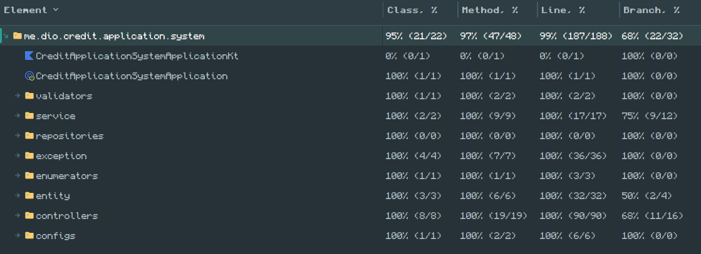

<h1 align="center">API para Sistema de Avaliação de Créditos</h1>
<p>Implementação do projeto desenvolvido ao longo do curso: Kotlin no Back End com Spring Boot (DIO)</p>
<p>Com a implementação dos desafios e adição de testes de integração para o Recurso de Crédito</p>

Máximo de parcelas permitido será 48
```java
@field:Min(1) @field:Max(48) val numberOfInstallment: Int
```

Data da primeira parcela deverá ser no máximo 3 meses após o dia atual
```java
@field:ThreeMonths val dayFirstInstallment: LocalDate
```
        
```java
@Target(
    AnnotationTarget.FIELD,
    AnnotationTarget.FUNCTION
)
@Retention(
    AnnotationRetention.RUNTIME
)
@Constraint(validatedBy = [ThreeMonthsValidation::class])
annotation class ThreeMonths(
    val message: String = "dayFirstInstallment pass the max 3 months post the actually date",
    val groups: Array<KClass<*>> = [],
    val payload: Array<KClass<out Payload>> = []
)
```

```java
class ThreeMonthsValidation : ConstraintValidator <ThreeMonths, LocalDate> {
    override fun isValid(value: LocalDate?, context: ConstraintValidatorContext?): Boolean {
        return value!!.isBefore(LocalDate.now().plusMonths(3))
    }
}
```
Cobertura de Testes

<p>Referência: <a>https://gist.github.com/cami-la/560b455b901778391abd2c9edea81286</a></p>